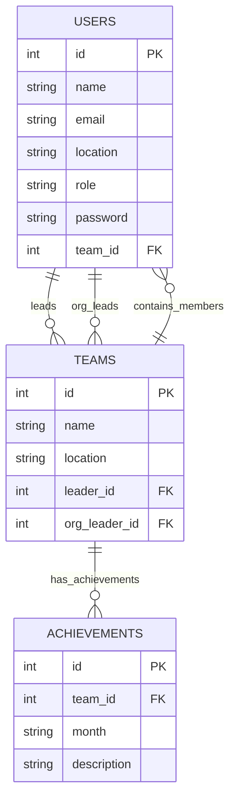

# Database Diagram (TeamFlow)

This document contains the standalone Entity Relationship Diagram (ERD) for the TeamFlow database.

## Relationship Summary
- One team can have many users (`users.team_id -> teams.id`).
- One user can lead many teams (`teams.leader_id -> users.id`).
- One user can be organization leader for many teams (`teams.org_leader_id -> users.id`).
- One team can have many achievements (`achievements.team_id -> teams.id`).
