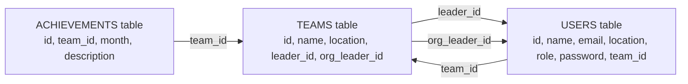

# Database Schema Diagram (Simple)

This is a simple version of the TeamFlow database diagram.

## Easy Meaning
- Each user belongs to one team.
- Each achievement belongs to one team.
- A team can have one leader user.
- A team can have one org leader user.
