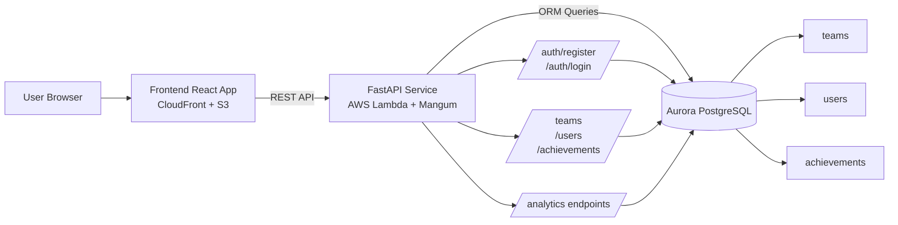
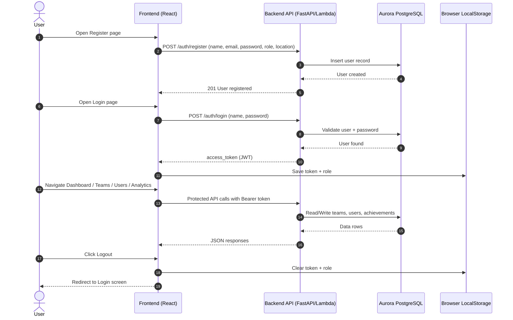

# EML Diagram (TeamFlow)

This document contains a Mermaid diagram representing the high-level flow between UI, API, and database.

## Notes
- Frontend is served through CloudFront.
- Backend runs as Lambda using Mangum.
- Database is Aurora PostgreSQL.
- Analytics endpoints aggregate data from teams, users, and achievements.

## Project Flow: Register to Logout

